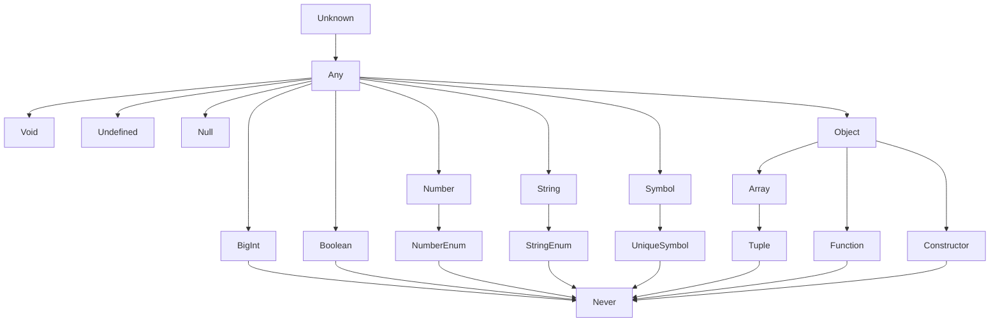

## Table of contents

## 类型

> 类型是一系列值，及可以对其的操作。

`TypeScript`中类型的结构如下：

```mermaid
graph TD
    Unknown --> Any
    Any --> Void
    Any --> Undefined
    Any --> Null
    Any --> Number
    Any --> BigInt
    Any --> Boolean
    Any --> String
    Any --> Symbol
    Any --> Object

    Number --> NumberEnum
    BigInt --> Never
    Boolean --> Never
    String --> StringEnum
    Symbol --> UniqueSymbol
    Object --> Array
    Object --> Function
    Object --> Constructor

    NumberEnum --> Never
    StringEnum --> Never
    UniqueSymbol --> Never
    Array --> Tuple
    Tuple --> Never
    Function --> Never
    Constructor --> Never
```

### 类型术语

- 可赋值性
- 界限
- 约束
